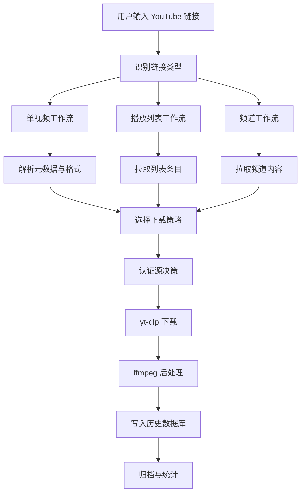

# YouTube `yt-dlp` 单核版重构与功能增强开发方案

## 1. 方案目标

本方案面向当前项目 [`JJH_download.pyw`](JJH_download.pyw)，目标是将现有“多平台 + 多下载器”桌面工具，重构为**仅保留 [`yt-dlp.exe`](yt-dlp.exe) + [`ffmpeg.exe`](ffmpeg.exe) 的 YouTube 专业下载器**。

核心原则：
- 删除 [`aria2c.exe`](aria2c.exe)、[`N_m3u8DL-RE.exe`](N_m3u8DL-RE.exe) 及全部非 YouTube 逻辑
- 停止在 [`JJH_download.pyw`](JJH_download.pyw) 中继续堆叠跨平台分支
- 先做产品收口与领域模型重构，再做深度功能增强
- 后续所有能力围绕 YouTube 下载、归档、认证、字幕和历史数据库展开

---

## 2. 当前现状总结

依据 [`JJH_download.pyw`](JJH_download.pyw)、[`使用说明_20250922.txt`](使用说明_20250922.txt)、[`帮助文档.txt`](帮助文档.txt)、[`config.json`](config.json) 可确认：

当前程序已经具备以下 YouTube 能力：
- 获取格式与分辨率
- 视频下载
- 音频下载
- 中英字幕嵌入
- 1080p / 720p 快捷下载
- cookies 文件兜底
- 重试、并发、限速
- 下载历史记录
- [`yt-dlp.exe`](yt-dlp.exe) 自更新

但同时也混入了大量非目标能力：
- Aria2 下载链路
- M3U8 下载链路
- Bilibili / TikTok / General 通用站点逻辑
- 多工具更新逻辑
- 多种历史文件结构
- 多套 UI 面板与兼容代码

这导致当前项目的主要问题不是“功能太少”，而是**目标不聚焦、领域模型不统一、扩展空间被架构噪音吞掉**。

---

## 3. 重构后的产品定位

### 3.1 新产品定义

将项目重定义为：

**YouTube 专业下载与归档桌面工具**

技术基座限定为：
- [`yt-dlp.exe`](yt-dlp.exe)
- [`ffmpeg.exe`](ffmpeg.exe)
- Python GUI 主程序 [`JJH_download.pyw`](JJH_download.pyw)

### 3.2 产品边界

#### 保留范围
- YouTube 单视频下载
- YouTube Shorts 下载
- YouTube Playlist 下载
- YouTube Channel / Uploads 下载
- YouTube Live / 回放下载
- cookies / 浏览器认证
- 字幕、封面、章节、元数据处理
- 历史记录、归档、增量同步

#### 删除范围
- [`aria2c.exe`](aria2c.exe)
- [`N_m3u8DL-RE.exe`](N_m3u8DL-RE.exe)
- Aria2 RPC 逻辑
- M3U8 下载逻辑
- Bilibili / TikTok / General 通用逻辑
- 对应配置、历史、日志、按钮、更新器、说明文档

---

## 4. 为什么必须先收口再增强

如果继续在 [`JJH_download.pyw`](JJH_download.pyw) 上用 `if/elif` 方式叠加功能，会出现以下问题：

1. YouTube 功能与非 YouTube 功能继续相互污染
2. 下载任务模型无法围绕 YouTube 深度建模
3. 历史结构无法支撑 `video_id / playlist_id / channel_id` 级别管理
4. UI 没有足够空间承载播放列表、频道、认证中心等高级功能
5. 任何新功能都会继续抬高维护成本

因此，正确路线是：

**先把系统从“杂糅工具”收口成“单域产品”，再做深功能深化。**

---

## 5. 总体开发路线图

整个开发建议拆成 6 个阶段：

1. 阶段 A：产品瘦身与非目标能力删除
2. 阶段 B：YouTube 领域模型与架构重构
3. 阶段 C：单视频下载专业化增强
4. 阶段 D：播放列表与频道能力增强
5. 阶段 E：认证中心、历史数据库与稳定性增强
6. 阶段 F：归档系统与运维能力增强

### 5.1 阶段切换治理规则

为避免连续开发导致缺陷累积，所有阶段必须遵守以下规则：

- 每一阶段开发完成后，必须先执行一次完整冒烟验证
- 冒烟验证通过后，才允许进入下一阶段开发
- 若冒烟验证失败，必须先修复阻塞问题并重新完成该阶段验证
- 阶段总结中必须记录本阶段的验证范围、验证结果和遗留风险

### 5.2 每阶段最小冒烟验证范围

每一阶段完成后，至少应覆盖以下检查：

- 程序可正常启动，主界面无初始化异常
- 当前阶段涉及的核心按钮、表单、下载流程可完整走通
- 当前阶段新增或重构的数据读写不会破坏已有配置、历史记录和日志
- [`yt-dlp.exe`](yt-dlp.exe) 与 [`ffmpeg.exe`](ffmpeg.exe) 的关键调用链路仍可正常工作
- 典型失败场景下，错误提示、日志记录和回退行为符合预期

### 5.3 文档执行要求

后续分步开发时，每个阶段都应显式包含两个收尾动作：

1. 完成该阶段实现
2. 完成该阶段完整冒烟验证并记录结果

未完成上述两个动作的阶段，不视为完成，不进入下一阶段。

---

## 6. 阶段 A：产品瘦身与非目标能力删除

### A.1 目标

把项目从多平台、多下载器状态，收口到 YouTube 单域。

### A.2 删除范围清单

#### 文件删除候选
建议后续代码模式中删除以下文件：
- [`aria2c.exe`](aria2c.exe)
- [`N_m3u8DL-RE.exe`](N_m3u8DL-RE.exe)
- [`aria2_config.json`](aria2_config.json)
- `download_history_m3u8.json`
- `download_history_aria2.json`
- `history_aria2.jsonl`
- `download_log_aria2.txt`
- 与 m3u8 / aria2 直接相关的说明文档
- 非 YouTube 相关旧资源文件

#### 代码删除范围
重点移除以下类型逻辑：
- [`DownloadTask._build_m3u8_command()`](JJH_download.pyw:671)
- Aria2 RPC 客户端及相关调用
- M3U8 更新逻辑
- M3U8 状态检查逻辑
- 非 YouTube URL 类型分支
- Bilibili / TikTok / General 下载分支
- 相关历史记录分支
- 相关 UI 页签和按钮

### A.3 输出结果

阶段 A 完成后，项目应满足：
- 任务类型只剩 YouTube
- 下载器只剩 [`yt-dlp.exe`](yt-dlp.exe)
- 媒体处理只剩 [`ffmpeg.exe`](ffmpeg.exe)
- UI 只保留 YouTube 场景
- 历史数据结构以 YouTube 为中心
- 配置文件大幅精简

### A.4 验收标准

- 启动程序后 UI 中不再出现 M3U8、Aria2、Bilibili、TikTok、通用网页入口
- 代码中不再出现非 YouTube 下载命令构建路径
- 非 YouTube 相关历史和配置不再读写
- 仅保留 `yt-dlp + ffmpeg` 的工具链检查与更新能力

### A.5 细化验收项

为确保阶段 A 不只是删除代码，而是真正完成产品收口，验收时应逐项核对以下内容：

#### A5.1 界面与交互验收
- 主界面中不再出现 m3u8、Aria2、Bilibili、TikTok、通用站点等入口、标签、按钮、提示文案
- URL 输入区的引导文案、占位提示、错误提示均改为面向 YouTube 场景
- 下载相关设置项中不再出现非 [`yt-dlp.exe`](yt-dlp.exe) 工具链配置
- 帮助入口、状态栏、弹窗中的产品表述统一为 YouTube 下载器

#### A5.2 配置与数据验收
- [`config.json`](config.json) 中不再保留非 YouTube 下载器、非 YouTube 站点、Aria2 RPC、m3u8 专属配置项
- 历史记录文件仅保留 YouTube 下载所需字段，不再混入其他下载类型标记
- 启动时即使存在旧配置或旧历史文件，也不会导致程序异常崩溃
- 旧数据若被忽略、迁移或废弃，必须有明确策略，不允许静默制造脏状态

#### A5.3 命令与执行链路验收
- 所有下载命令构建逻辑均收敛到 [`yt-dlp.exe`](yt-dlp.exe) + [`ffmpeg.exe`](ffmpeg.exe) 路径
- 不再存在调用 Aria2、m3u8 下载器、通用站点分流器的代码入口
- 下载前检查、失败重试、日志记录、后处理链路在 YouTube 场景下仍然可用
- 工具检查与更新逻辑只保留 [`yt-dlp.exe`](yt-dlp.exe) 与 [`ffmpeg.exe`](ffmpeg.exe)

#### A5.4 文档与资源验收
- [`帮助文档.txt`](帮助文档.txt) 与 [`使用说明_20250922.txt`](使用说明_20250922.txt) 中的产品说明与功能描述完成同步收口
- 非目标工具的说明文本、更新说明、使用提示不再保留
- 项目根目录中的资源文件命名和保留理由清晰，避免残留无用途旧文件

### A.6 阶段 A 冒烟清单

阶段 A 开发完成后，进入阶段 B 前，必须完整执行以下冒烟验证：

#### A6.1 启动与基础可用性
- 启动 [`JJH_download.pyw`](JJH_download.pyw) 后，主窗口可正常显示
- 启动阶段不出现缺失旧模块、缺失旧配置、缺失旧资源导致的异常
- 默认配置下可进入主流程，无阻塞性报错弹窗

#### A6.2 YouTube 核心流程
- 输入一个有效 YouTube 视频链接后，可正常解析信息或进入下载准备流程
- 视频下载流程可成功启动，日志输出正常
- 音频下载或快速预设下载至少验证一种仍然可用
- 字幕、封面或合并等现有 YouTube 后处理能力至少验证一项未被误伤

#### A6.3 非目标能力隔离验证
- 输入非 YouTube 链接时，程序不会再走旧的多站点下载分支
- 若保留错误提示，则应明确提示当前产品仅支持 YouTube
- 不会因删除 Aria2 或 m3u8 逻辑而出现悬空按钮、悬空菜单或死代码触发路径

#### A6.4 数据兼容与回归验证
- 已存在的 [`download_history_ytdlp.json`](download_history_ytdlp.json) 可正常读取或平稳兼容
- 已存在的 [`download_history_m3u8.json`](download_history_m3u8.json) 等旧文件即使保留在磁盘上，也不会影响程序主流程
- 下载完成后的历史、日志、配置写入行为正常，无字段错乱或写入失败

#### A6.5 阶段结项要求
- 记录本阶段删除的文件、移除的模块、保留的兼容策略
- 记录本阶段完整冒烟结果与未解决风险
- 上述冒烟全部通过后，方可进入阶段 B

### A.7 阶段 A 代码实施清单

以下清单面向后续 [`code`](JJH_download.pyw) 模式直接执行，顺序不应颠倒：

1. 先梳理 [`JJH_download.pyw`](JJH_download.pyw) 中仍残留的非 YouTube 术语、注释、占位文案和兼容痕迹
2. 清理界面中的历史遗留表述，确保主窗口、输入提示、按钮说明、错误提示统一为 YouTube 下载器
3. 复核 URL 检测、任务创建、格式获取、直接下载等入口，确保非 YouTube 链接只走“当前版本仅支持 YouTube”路径
4. 复核下载命令构建与任务执行链路，确保只依赖 [`yt-dlp.exe`](yt-dlp.exe) 和 [`ffmpeg.exe`](ffmpeg.exe)
5. 清理历史、配置、日志相关的旧兼容表述，避免后续代码继续读写非目标能力残留字段
6. 同步收口 [`帮助文档.txt`](帮助文档.txt) 与 [`使用说明_20250922.txt`](使用说明_20250922.txt) 的产品说明
7. 执行阶段 A 完整冒烟清单并记录结果

### A.8 阶段 A 实施顺序与影响范围

#### A8.1 第一批修改
- 目标文件：[`JJH_download.pyw`](JJH_download.pyw)
- 重点区域：URL 检测、任务构建、格式获取、主窗口标题、页签标题、提示文案、日志文案
- 预期结果：UI 和主流程彻底聚焦 YouTube

#### A8.2 第二批修改
- 目标文件：[`config.json`](config.json)、[`download_history_ytdlp.json`](download_history_ytdlp.json)
- 重点区域：仅在确认存在旧结构时处理兼容读取策略，不急于扩大数据迁移范围
- 预期结果：阶段 A 优先保证“不再继续扩散旧结构”，而不是一次性重做历史体系

#### A8.3 第三批修改
- 目标文件：[`帮助文档.txt`](帮助文档.txt)、[`使用说明_20250922.txt`](使用说明_20250922.txt)
- 重点区域：产品描述、使用限制、cookies 提示、工具链说明
- 预期结果：代码与文档表述一致

### A.9 阶段 A 开发前置条件

在切换到 [`code`](JJH_download.pyw) 模式实施前，应默认遵守以下边界：

- 本阶段以收口和删除为主，不引入阶段 B 及之后的新架构拆分
- 除非发现阻塞性问题，否则不在阶段 A 顺手扩展新功能
- 任何改动都要服务于“仅支持 YouTube + 仅保留 [`yt-dlp.exe`](yt-dlp.exe) / [`ffmpeg.exe`](ffmpeg.exe)”这一目标
- 代码完成后必须按 [`A.6`](plans/youtube_yt_dlp_重构与功能增强开发方案.md) 执行完整冒烟，再决定是否进入下一阶段

---

## 7. 阶段 B：YouTube 领域模型与架构重构

### B.1 目标

把现有围绕“站点类型 + 下载器类型”的拼装式结构，改造成围绕 YouTube 业务对象的领域模型。

### B.2 推荐目录结构

建议逐步从单文件 [`JJH_download.pyw`](JJH_download.pyw) 拆分为如下结构：

```text
core/
  youtube_models.py
  youtube_metadata.py
  ytdlp_builder.py
  download_manager.py
  auth_manager.py
  history_repo.py
  postprocess.py
  settings.py
ui/
  app.py
  pages/
    single_video.py
    playlist.py
    channel.py
    history_center.py
    auth_center.py
services/
  playlist_service.py
  channel_service.py
  subscription_service.py
plans/
```

### B.3 核心领域对象

建议建立以下对象：
- `YouTubeMediaInfo`
- `YouTubeFormatInfo`
- `YouTubeSubtitleTrack`
- `YouTubeAuthProfile`
- `YouTubeDownloadProfile`
- `YouTubeTaskRecord`
- `YouTubePlaylistInfo`
- `YouTubeChannelInfo`
- `SubscriptionRule`

### B.4 重构原则

- 命令构建与 UI 解耦
- 任务执行与元数据解析解耦
- 认证逻辑独立管理
- 历史持久化从 UI 逻辑中抽离
- 所有下载策略围绕 YouTube 设计，而非围绕旧站点兼容设计

### B.5 验收标准

- YouTube 下载任务具备独立的数据模型
- [`JJH_download.pyw`](JJH_download.pyw) 不再承担全部业务逻辑
- 新功能可在不修改旧分支的前提下扩展

### B.6 阶段冒烟要求

阶段 B 开发完成后，必须执行完整冒烟测试；仅在冒烟通过后，才允许进入阶段 C。至少包括：

- 架构拆分后程序仍可正常启动，核心入口无导入错误
- 新增模块之间的调用关系正确，YouTube 核心流程可正常跑通
- 旧功能未因模块拆分出现回归性故障
- 数据模型、命令构建、历史写入三条主链路均可正常协同
- 记录本阶段冒烟范围、结果与遗留风险

---

## 8. 阶段 C：单视频下载专业化增强

### C.1 目标

把当前“输入 URL -> 获取格式 -> 立即下载”的轻量流程，升级为专业单视频工作台。

### C.2 功能项

#### C2.1 视频详情卡片
在解析后展示：
- 标题
- 视频 ID
- 频道名 / 频道 ID
- 上传日期
- 时长
- 缩略图
- 观看数
- 默认语言
- 是否直播回放
- 是否 Shorts
- 是否年龄限制 / 会员限制

#### C2.2 专业格式表格
用表格替代简单下拉框，展示：
- `format_id`
- 分辨率
- `fps`
- `vcodec`
- `acodec`
- `ext`
- `protocol`
- `filesize`
- 动态范围 HDR/SDR
- 是否仅视频 / 仅音频
- 是否需合并

并支持筛选：
- 仅 MP4
- 仅带音频
- 仅 60fps
- 仅 4K+
- 仅音频轨
- 按大小排序
- 按画质排序

#### C2.3 下载策略预设
新增策略预设，而不是只允许手选格式：
- 最佳画质
- 最佳兼容
- 最高 1080p
- 最高 4K
- 仅音频
- 最小体积
- 保留原始编码
- HDR 优先
- 高帧率优先

#### C2.4 音频导出增强
支持：
- m4a
- mp3
- opus
- wav
- flac
- 音质档位选择
- 封面嵌入
- 元数据嵌入

#### C2.5 视频后处理增强
支持：
- 输出容器选择 mp4 / mkv
- 强制 H.264 兼容模式
- 章节写入
- 缩略图写入
- 元数据写入
- 保留原始分离轨道

### C.3 UI 改造建议

单视频页建议包含：
- URL 输入区
- 信息解析按钮
- 视频详情卡片
- 格式表格
- 下载策略区
- 字幕区
- 命名模板预览区
- 下载按钮

### C.4 验收标准

- 用户无需手动猜格式含义即可理解下载选项
- 同一视频可通过策略预设快速完成常见下载场景
- 单视频下载能力显著强于当前实现

### C.5 阶段冒烟要求

阶段 C 开发完成后，必须执行完整冒烟测试；仅在冒烟通过后，才允许进入阶段 D。至少包括：

- 单视频解析、格式展示、策略选择、下载启动四个步骤完整可用
- 典型预设如最佳画质、最高 1080p、仅音频至少各验证一项
- 后处理能力如合并、元数据、封面或章节至少验证一项未回归
- 异常场景下错误提示、日志输出和任务状态更新符合预期
- 记录本阶段冒烟范围、结果与遗留风险

---

## 9. 阶段 D：字幕系统增强

### D.1 目标

把当前简单的“中英字幕嵌入”升级为完整字幕系统。

### D.2 功能项

#### D2.1 字幕来源策略
支持：
- 人工字幕优先
- 自动字幕兜底
- 人工字幕 + 自动字幕同时下载
- 多语言优先级链

#### D2.2 多语言支持
支持：
- 多选语言
- 简中 / 繁中 / 英文 / 日文等优先级组合
- 主字幕 + 副字幕
- 双语字幕输出

#### D2.3 输出方式
支持：
- 外挂字幕
- 内嵌字幕
- 同时外挂 + 内嵌
- 导出 `srt / vtt / ass`
- 仅字幕下载

#### D2.4 字幕后处理
支持：
- `vtt -> srt` 转换
- 自动字幕文本清洗
- 双语合并预留接口

### D.3 验收标准

- 字幕不再只是单个语言的简单嵌入
- 用户可以独立控制字幕来源、语言、格式和输出方式

### D.4 阶段冒烟要求

阶段 D 开发完成后，必须执行完整冒烟测试；仅在冒烟通过后，才允许进入阶段 E。至少包括：

- 人工字幕优先、自动字幕兜底、多语言选择至少各验证一项
- 外挂字幕、内嵌字幕或同时输出中的关键路径可正常执行
- 字幕格式转换与字幕下载流程不会破坏原有视频下载能力
- 字幕失败时可正确提示原因并保留日志
- 记录本阶段冒烟范围、结果与遗留风险

---

## 10. 阶段 E：播放列表与频道能力增强

### E.1 目标

让程序从单视频下载器，升级为 YouTube 内容集合下载工具。

### E.2 播放列表功能

支持：
- 解析 playlist 标题和总条数
- 列表预览
- 勾选条目下载
- 序号区间下载
- 跳过已下载 `video_id`
- 失败项单独重试
- 自动按播放列表归档

### E.3 频道功能

支持：
- 获取频道 `uploads`
- 获取 Shorts
- 获取 Live 回放
- 按日期范围筛选
- 按标题关键字筛选
- 增量下载未归档视频

### E.4 批量导入

支持：
- 多链接粘贴
- TXT 导入
- CSV 导入
- 一行一个任务
- 每行附带策略模板

### E.5 UI 建议

新增两个页面：
- `播放列表下载`
- `频道与增量同步`

### E.6 验收标准

- 用户可以直接下载整套课程、播客列表、频道上传内容
- 支持去重和再次同步，而不是每次手动单条输入

### E.7 阶段冒烟要求

阶段 E 开发完成后，必须执行完整冒烟测试；仅在冒烟通过后，才允许进入阶段 F。至少包括：

- 播放列表解析、条目选择、批量下载三条路径可正常工作
- 频道 uploads、Shorts、Live 回放中的至少两类内容可正常拉取
- 去重、增量同步、失败重试至少验证一项核心逻辑
- 批量导入不会破坏单视频下载主流程
- 记录本阶段冒烟范围、结果与遗留风险

---

## 11. 阶段 F：认证中心与 cookies 体系增强

### F.1 目标

把现在依赖单个 [`www.youtube.com_cookies.txt`](www.youtube.com_cookies.txt) 文件的方式，升级为可管理、可测试、可切换的认证中心。

### F.2 功能项

#### F2.1 认证源管理
支持：
- 导入 cookies 文件
- 从浏览器读取 cookies
- 多账号配置
- 账号备注
- 最近成功时间
- 认证源启用/停用

#### F2.2 认证测试
提供测试按钮，用于验证：
- 年龄限制视频可否访问
- 登录限制视频可否访问
- 是否触发机器人验证

#### F2.3 失效管理
支持：
- 失败原因分类展示
- 状态标记：正常 / 风险 / 失效
- 自动切换备用认证源
- 到期提醒

### F.3 验收标准

- 用户不需要手动猜测 cookies 是否失效
- 下载失败时可以明确知道是认证问题还是网络问题

### F.4 阶段冒烟要求

阶段 F 开发完成后，必须执行完整冒烟测试；仅在冒烟通过后，才允许进入阶段 G。至少包括：

- 多认证源导入、启用、切换至少各验证一项
- 认证测试能区分登录限制、年龄限制或认证失效等典型问题
- 认证异常不会阻塞普通公开视频下载主流程
- cookies 状态展示、失败提示和日志记录一致可追踪
- 记录本阶段冒烟范围、结果与遗留风险

---

## 12. 阶段 G：历史数据库化与失败诊断增强

### G.1 目标

把当前轻量 JSON 历史，升级为可查询、可重试、可统计的任务数据库。

### G.2 持久化升级

建议从 JSON 迁移到 SQLite。

### G.3 推荐数据表

建议设计：
- `media`
- `tasks`
- `outputs`
- `playlists`
- `channels`
- `auth_profiles`
- `subscriptions`
- `error_logs`

### G.4 关键字段

至少记录：
- `video_id`
- `playlist_id`
- `channel_id`
- 标题
- 上传者
- 上传日期
- 时长
- URL
- 选择的策略
- 选择的格式
- 字幕语言
- cookies 来源
- 任务状态
- 重试次数
- 执行耗时
- 输出文件路径
- 失败原因类别
- 原始错误摘录

### G.5 历史中心能力

支持：
- 再次下载
- 按新策略重新下载
- 查看输出文件
- 查看失败原因
- 导出 CSV / JSON
- 按频道筛选
- 按播放列表筛选
- 去重检查

### G.6 失败诊断能力

支持分类：
- cookies 失效
- 网络错误
- 格式不可用
- ffmpeg 合并失败
- 文件名冲突
- 权限错误
- 磁盘空间不足

### G.7 验收标准

- 历史中心不再只是“文本列表”，而是任务档案库
- 可以基于历史做统计、去重、重试、归档与同步

### G.8 阶段冒烟要求

阶段 G 开发完成后，必须执行完整冒烟测试；仅在冒烟通过后，才允许进入阶段 H。至少包括：

- 历史迁移、任务写入、查询筛选至少各验证一项
- 再次下载、失败重试、结果导出至少验证一项核心路径
- 失败分类能正确区分网络、认证、格式、ffmpeg 或文件系统类问题
- 数据库存储引入后不会破坏现有主下载流程
- 记录本阶段冒烟范围、结果与遗留风险

---

## 13. 阶段 H：订阅同步、归档与长期能力增强

### H.1 目标

让工具具备长期使用价值，而不仅是一次性下载工具。

### H.2 功能项

#### H2.1 订阅规则
支持保存：
- 频道 URL
- 扫描范围
- 下载策略模板
- 字幕策略
- 认证源
- 保存路径
- 去重规则

#### H2.2 增量同步
支持：
- 每次只下载新视频
- 按时间窗口同步
- 按内容类型同步

#### H2.3 归档模板
支持：
- 按频道归档
- 按播放列表归档
- 按日期归档
- 按类型归档 视频/音频/字幕

#### H2.4 统计面板
支持：
- 今日下载数
- 本周下载数
- 成功率 / 失败率
- 平均下载速度
- 最常下载频道
- 空间占用统计

### H.3 验收标准

- 用户可以长期把该程序作为 YouTube 内容归档中心使用
- 不再局限于临时下载单个视频

### H.4 阶段冒烟要求

阶段 H 开发完成后，必须执行完整冒烟测试，作为整条开发路线的最终结项验证。至少包括：

- 订阅规则创建、保存、修改、执行至少各验证一项
- 增量同步能够正确识别新内容并避免重复下载
- 归档模板、统计面板、历史中心之间的数据联动正确
- 长周期场景下关键流程不会破坏前序阶段已交付能力
- 记录本阶段冒烟范围、结果、遗留风险与后续优化方向

---

## 14. 建议的信息架构

建议最终 UI 拆成 5 个主区域：

1. 单视频下载
2. 播放列表下载
3. 频道与订阅同步
4. 历史与归档中心
5. 认证与设置中心

### 可选工作流示意图



---

## 15. 分步实施清单

以下清单可直接作为后续代码模式执行的开发任务：

### 第 1 步：收口产品边界
- 删除非 YouTube 相关入口与文案
- 清理 m3u8 / aria2 / 非 YouTube 逻辑
- 收敛历史与配置文件

### 第 2 步：重构任务模型
- 建立 YouTube 专属任务对象
- 从旧的多类型命令构建器中抽离 YouTube 命令生成
- 拆分 UI 与业务逻辑

### 第 3 步：做单视频专业工作台
- 视频详情卡片
- 专业格式表格
- 下载策略预设
- 命名模板预览

### 第 4 步：做完整字幕系统
- 多语言字幕选择
- 来源策略控制
- 外挂/内嵌/仅字幕下载
- 格式转换

### 第 5 步：做播放列表能力
- 播放列表解析
- 条目勾选
- 区间下载
- 去重与失败重试

### 第 6 步：做频道与增量同步
- 频道 uploads 解析
- Shorts / Live 分类
- 日期范围过滤
- 增量同步规则

### 第 7 步：做认证中心
- cookies 文件管理
- 浏览器导入
- 认证测试
- 自动备用切换

### 第 8 步：升级历史数据库
- SQLite 建库
- 任务档案结构
- 错误分类与再次下载
- 统计面板基础版

### 第 9 步：做归档与订阅
- 命名模板
- 归档目录模板
- 订阅规则
- 增量归档

### 第 10 步：做稳定性与诊断增强
- 失败归因系统
- 环境检查
- 命令预览
- 日志导出

---

## 16. 推荐里程碑版本

### V3.0
目标：YouTube 单核版
- 删除非 YouTube / 非 `yt-dlp` 能力
- 完成产品收口

### V3.1
目标：YouTube 专业单视频版
- 视频详情卡片
- 专业格式表格
- 策略化下载
- 字幕增强

### V3.2
目标：播放列表与频道版
- 播放列表工作台
- 频道工作台
- 去重与增量下载

### V3.3
目标：认证与历史数据库版
- 认证中心
- SQLite 历史库
- 失败分析
- 再次下载

### V3.4
目标：归档与订阅版
- 订阅同步
- 归档模板
- 统计看板

---

## 17. 风险与注意事项

### 17.1 删除阶段风险
- 旧 UI 与旧历史兼容逻辑较多，删除时容易牵一发动全身
- 需要避免误删当前 YouTube 仍在使用的公共辅助函数

### 17.2 架构重构风险
- [`JJH_download.pyw`](JJH_download.pyw) 体量较大，建议分阶段抽离，而不是一次性重写
- 重构期间需保持最小可运行版本

### 17.3 数据迁移风险
- 从 JSON 迁移到 SQLite 时，需考虑旧历史是否导入
- 若不导入，需要明确版本切换说明

### 17.4 认证风险
- 浏览器 cookies 提取方案需考虑 Windows 环境兼容性
- cookies 失效检测需避免误判

---

## 18. AI 分步开发提示词文档

本章节用于后续驱动 AI 编码助手按阶段推进开发。目标不是让 AI 一次性大改，而是让 AI 在每一步都围绕 [`plans/youtube_yt_dlp_重构与功能增强开发方案.md`](plans/youtube_yt_dlp_重构与功能增强开发方案.md) 的边界执行。

### 18.1 总体开发规则

以下规则适用于所有阶段、所有提示词：

1. **产品边界固定**
   - 当前项目只允许保留 YouTube 相关能力
   - 删除或忽略 [`aria2c.exe`](aria2c.exe)、[`N_m3u8DL-RE.exe`](N_m3u8DL-RE.exe) 与所有非 YouTube 功能
   - 不再新增 Bilibili、TikTok、M3U8、通用网页下载逻辑

2. **技术边界固定**
   - 下载后端只允许使用 [`yt-dlp.exe`](yt-dlp.exe)
   - 媒体处理只允许使用 [`ffmpeg.exe`](ffmpeg.exe)
   - 任何新能力都必须基于 YouTube + `yt-dlp` 工作流设计

3. **禁止一次性重写全部系统**
   - 只能分步迭代
   - 每次只做一个清晰的小阶段
   - 每步都要保持程序可运行、可回退、可验证

4. **优先重构结构，再增加功能**
   - 如果现有结构明显阻碍开发，先拆模块、降耦合，再加功能
   - 不允许在 [`JJH_download.pyw`](JJH_download.pyw) 中继续无序堆叠 `if/elif`

5. **所有开发都要有验收标准**
   - 每次修改前先写目标
   - 每次修改后输出完成项、影响范围、验证方式、剩余问题

6. **优先保证兼容现有可用能力**
   - 删除非 YouTube 能力时，不能误伤现有 YouTube 下载主流程
   - 重构期间要保留最小可运行版本

7. **数据结构优先围绕 YouTube 建模**
   - 优先使用 `video_id`、`playlist_id`、`channel_id` 作为核心标识
   - 不再围绕旧的多站点兼容模型做抽象

8. **UI 改造遵循先简后繁**
   - 第一优先保证流程清晰
   - 第二优先增强专业能力
   - 不要先堆高级控件而忽略主流程可用性

9. **日志与错误处理必须同步增强**
   - 新功能加入时，必须补充日志、错误分类、失败提示
   - 不能只实现按钮，不处理失败场景

10. **文档同步更新**
   - 每完成一个阶段，都要同步更新 [`plans/youtube_yt_dlp_重构与功能增强开发方案.md`](plans/youtube_yt_dlp_重构与功能增强开发方案.md) 或新增对应阶段文档

### 18.2 AI 输出格式规则

每次让 AI 执行开发任务时，提示词都应要求 AI 输出以下内容：
- 本次目标
- 受影响文件
- 具体修改点
- 风险点
- 验证方法
- 未完成项

如需改代码，应要求 AI：
- 先阅读相关文件再修改
- 优先小步修改
- 不做与当前阶段无关的顺手重构
- 不擅自删除未确认的 YouTube 逻辑

---

### 18.3 阶段 A 提示词：删除非目标能力并收口产品边界

#### 使用目标
用于删除 m3u8、aria2、Bilibili、TikTok、General 等非目标功能，收口为 YouTube 单核产品。

#### AI 提示词
你正在重构项目 [`JJH_download.pyw`](JJH_download.pyw)。

当前目标：把项目从多平台、多下载器工具，收口为仅保留 YouTube + [`yt-dlp.exe`](yt-dlp.exe) + [`ffmpeg.exe`](ffmpeg.exe) 的桌面下载器。

请严格执行以下要求：
- 删除或移除所有 m3u8、aria2、Bilibili、TikTok、General 相关逻辑
- 删除相关 UI 入口、任务类型、历史记录读写、配置读写和工具状态检查
- 保留现有 YouTube 下载主流程可运行
- 不在本步骤引入播放列表、频道、数据库等新功能
- 先做“删除和收口”，不要做额外扩展

请先分析以下内容：
- 哪些文件和代码段属于非 YouTube 范围
- 删除这些代码后，哪些公共函数仍会被 YouTube 使用
- 哪些 UI 组件需要同步删减

然后输出：
1. 删除清单
2. 修改计划
3. 风险点
4. 逐步实施方案

如果进入代码实现，要求：
- 每次只删一组明确的功能
- 删除后说明影响范围
- 保证程序仍可启动

#### 阶段验收要求
- UI 中不再出现非 YouTube 入口
- 代码中不再出现非 YouTube 下载主流程
- 仅保留 `yt-dlp + ffmpeg` 工具链

---

### 18.4 阶段 B 提示词：YouTube 领域模型与代码结构重构

#### 使用目标
用于把旧的多类型下载模型，重构为围绕 YouTube 的领域模型。

#### AI 提示词
你正在基于 [`JJH_download.pyw`](JJH_download.pyw) 重构项目架构。

当前目标：把现有围绕多站点、多下载器设计的任务模型，改造成围绕 YouTube 的领域模型和模块结构。

请严格遵守：
- 当前只处理架构和模型重构
- 不在本步骤新增复杂 UI 功能
- 不新增播放列表、频道、订阅能力
- 不再扩展旧的多站点兼容分支

请完成以下工作：
- 识别现有任务模型、命令构建、元数据解析、历史记录、认证逻辑的边界
- 设计适合 YouTube 的模块拆分方案
- 给出推荐的数据类和职责划分
- 设计从单文件逐步抽离到模块化结构的迁移顺序

输出要求：
1. 当前耦合点分析
2. 新模块设计
3. 数据对象设计
4. 拆分顺序
5. 每一步迁移后的可运行状态说明

如果进入代码实现，优先做：
- 提取纯数据模型
- 提取命令构建器
- 提取认证逻辑
- 提取历史仓储接口

#### 阶段验收要求
- YouTube 下载主流程不再完全耦合在单文件中
- 新增功能可以在模块层扩展，而不是继续堆分支

---

### 18.5 阶段 C 提示词：单视频下载专业化增强

#### 使用目标
用于增强单视频下载体验，使其成为专业工作台。

#### AI 提示词
当前项目已经收口为 YouTube 单核工具。现在请只针对“单视频下载”做专业化增强。

请严格限制范围：
- 只做单视频页面与单视频下载链路
- 不做播放列表、频道、订阅功能
- 不改数据库层，除非当前功能必须依赖

本阶段目标包括：
- 增加视频详情卡片
- 用格式表格替代简单下拉框
- 增加下载策略预设
- 增加命名模板预览
- 增强音频导出与视频后处理选项

请先分析：
- 当前 [`fetch_formats()`](JJH_download.pyw:3582) 和相关 UI 存在哪些限制
- 哪些字段可以从 `yt-dlp --dump-single-json` 中获取并用于展示
- 现有下载命令构建如何升级为“策略驱动”

输出要求：
1. 单视频页面改造方案
2. 数据字段设计
3. 下载策略设计
4. UI 交互流程
5. 实施步骤与风险点

如果进入代码实现，应优先顺序：
- 先加元信息展示
- 再加格式表格
- 再加下载策略
- 最后补后处理选项

#### 阶段验收要求
- 用户能看见完整视频信息
- 用户能更直观地理解可下载格式
- 常用下载场景不必手工拼 format

---

### 18.6 阶段 D 提示词：字幕系统增强

#### 使用目标
用于把简单字幕选项升级为完整字幕系统。

#### AI 提示词
当前请只围绕 YouTube 字幕系统进行增强，不处理其它功能模块。

本阶段目标：
- 支持人工字幕优先、自动字幕兜底
- 支持多语言字幕选择
- 支持外挂、内嵌、仅字幕下载
- 支持字幕格式转换

请先分析当前字幕实现：
- [`DownloadTask._build_ytdlp_command()`](JJH_download.pyw:600) 中字幕参数能力有哪些限制
- 当前 UI 是否只支持单语言和简单开关
- 哪些参数适合抽象成字幕策略对象

输出要求：
1. 当前字幕实现问题
2. 新字幕策略设计
3. UI 改造点
4. 命令构建改造点
5. 分步实施方案

如果进入代码实现，要求：
- 先支持来源策略
- 再支持多语言
- 再支持输出模式
- 最后支持转换与清洗

#### 阶段验收要求
- 用户能控制字幕来源、语言和输出方式
- 字幕下载不再依赖单一固定参数组合

---

### 18.7 阶段 E 提示词：播放列表功能开发

#### 使用目标
用于新增 YouTube 播放列表解析、勾选与批量下载能力。

#### AI 提示词
当前项目已经具备单视频下载能力。现在请只开发 YouTube 播放列表功能。

请严格限制：
- 不做频道订阅
- 不做长期调度
- 不做数据库大改，除非实现播放列表去重必须依赖

本阶段目标：
- 解析播放列表信息
- 展示条目列表
- 支持勾选下载
- 支持区间下载
- 支持跳过已下载 `video_id`
- 支持按播放列表目录归档

请先分析：
- 如何从 `yt-dlp` 获取 playlist 元数据与条目清单
- 现有任务系统是否支持批量子任务
- 哪些 UI 结构最适合条目勾选和批量操作

输出要求：
1. 播放列表数据结构
2. UI 交互设计
3. 任务拆分方式
4. 去重机制
5. 实施步骤与风险点

如果进入代码实现，应优先顺序：
- 先做解析与展示
- 再做勾选和区间选择
- 再做批量入队
- 最后做归档与去重

#### 阶段验收要求
- 用户可以下载整个播放列表或其中部分条目
- 播放列表下载不再依赖手动逐条复制 URL

---

### 18.8 阶段 F 提示词：频道与增量同步开发

#### 使用目标
用于开发频道 uploads、Shorts、Live 回放和增量下载能力。

#### AI 提示词
当前请只开发 YouTube 频道内容下载与增量同步能力。

限制要求：
- 不做定时调度器
- 不做多平台订阅
- 不把本阶段扩展成完整自动化系统

本阶段目标：
- 解析频道 uploads
- 解析 Shorts / Live 回放
- 支持日期范围筛选
- 支持标题关键字过滤
- 支持只下载新增内容

请先分析：
- 频道内容抓取的 `yt-dlp` 元数据能力
- 当前历史数据是否足以做基础增量判定
- 频道页面需要哪些最小交互元素

输出要求：
1. 频道数据模型
2. 增量同步判定逻辑
3. UI 方案
4. 历史依赖分析
5. 分步实施方案

如果进入代码实现，应优先顺序：
- 先做频道解析
- 再做筛选
- 再做新增判断
- 最后做批量任务入队

#### 阶段验收要求
- 用户可以下载频道最近上传内容
- 支持最基本的增量同步，而不是重复全量下载

---

### 18.9 阶段 G 提示词：认证中心与 cookies 管理开发

#### 使用目标
用于把当前单文件 cookies 兜底，升级为可管理的认证中心。

#### AI 提示词
当前请只处理 YouTube 认证中心和 cookies 管理，不处理其它新功能。

本阶段目标：
- 支持 cookies 文件导入
- 支持浏览器 cookies 读取
- 支持多认证源管理
- 支持认证测试
- 支持失效状态标记与切换

请先分析当前认证逻辑：
- [`detect_cookies_error()`](JJH_download.pyw:183) 的覆盖范围是否足够
- [`notify_cookies_error()`](JJH_download.pyw:3162) 是否只能做被动提醒
- 当前任务执行中 cookies 的注入时机是否合理

输出要求：
1. 当前认证逻辑问题
2. 认证源模型设计
3. 测试与状态机设计
4. UI 改造方案
5. 分步实施计划

如果进入代码实现，应优先顺序：
- 先抽离认证模型
- 再增加多来源管理
- 再增加认证测试
- 最后增加自动切换与状态展示

#### 阶段验收要求
- 用户可以明确管理多个 cookies 来源
- 失败时能看见清晰的认证状态与原因

---

### 18.10 阶段 H 提示词：历史数据库与错误诊断开发

#### 使用目标
用于把 JSON 历史升级为可查询、可筛选、可重试的数据库系统。

#### AI 提示词
当前请只开发历史数据库和错误诊断增强，不处理其它产品能力。

本阶段目标：
- 把轻量 JSON 历史升级为 SQLite
- 按 `video_id / playlist_id / channel_id` 存档
- 支持再次下载
- 支持错误分类与查询
- 支持基础统计

请先分析：
- 当前 [`HISTORY_FILES`](JJH_download.pyw:60) 的结构限制
- 当前 [`show_history()`](JJH_download.pyw:2962) 为什么不足以支撑复杂场景
- 迁移时哪些字段必须补齐

输出要求：
1. 数据库表设计
2. 旧历史迁移策略
3. 错误分类设计
4. 历史中心 UI 方案
5. 分步实施计划

如果进入代码实现，应优先顺序：
- 先建库和仓储接口
- 再接入写入路径
- 再接入查询 UI
- 最后接入再次下载和统计

#### 阶段验收要求
- 历史中心具备筛选、重试、归档与查询能力
- 不再只是简单文本回显

---

### 18.11 阶段 I 提示词：订阅同步、归档模板与长期能力开发

#### 使用目标
用于把工具从下载器升级为长期归档工具。

#### AI 提示词
当前请只开发订阅同步、归档模板与长期使用能力，不处理前面阶段之外的额外需求。

本阶段目标：
- 增加订阅规则
- 增加归档模板
- 增加增量同步配置
- 增加统计看板基础能力

请先分析：
- 当前历史数据库是否足以支撑订阅规则
- 哪些订阅规则字段最小可行
- 归档模板应如何与下载模板配合

输出要求：
1. 订阅规则模型
2. 归档模板模型
3. 同步流程设计
4. UI 与交互方案
5. 分步实施计划

如果进入代码实现，应优先顺序：
- 先做规则保存
- 再做手动同步
- 再做归档模板
- 最后做统计面板

#### 阶段验收要求
- 用户可以把程序作为长期 YouTube 归档工具使用
- 订阅、归档、增量同步三者形成闭环

---

## 19. 最终建议结论

这个项目最值得做的，不是继续在 [`JJH_download.pyw`](JJH_download.pyw) 里追加更多零散按钮，而是先完成一次明确的产品收口：

- 删除 [`aria2c.exe`](aria2c.exe)
- 删除 [`N_m3u8DL-RE.exe`](N_m3u8DL-RE.exe)
- 删除所有非 YouTube 逻辑
- 把项目从“多站点工具”重构为“专注 YouTube 的 `yt-dlp` 单核桌面工具”

在这个基础上，再分阶段推进：
- 单视频专业化
- 字幕系统升级
- 播放列表与频道下载
- 认证中心
- 历史数据库化
- 归档与订阅同步

这条路线能够显著降低复杂度，同时显著提高后续功能的上限和可维护性。
